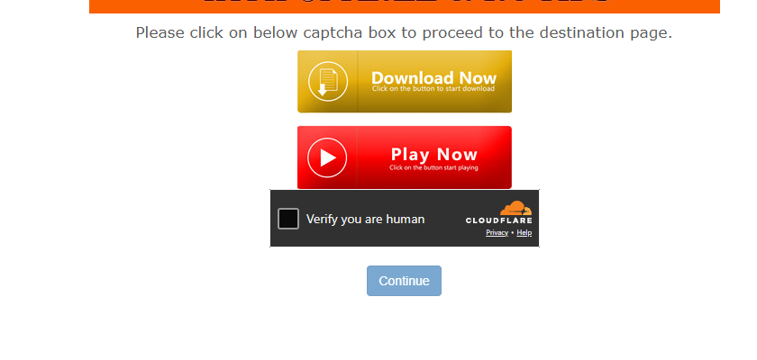

# bypass-cloudflare-bot-check

A minimal helper for Puppeteer/Playwright automation that reduces Cloudflare "browser bot" detection signals by patching a few navigator properties and other small runtime tweaks.

## What it does
- Removes the `navigator.webdriver` flag that many bot-detection scripts check.
- Applies a small set of runtime tweaks that make headless browser automation appear more like a regular browser session.
- Includes small helper utilities useful when scraping (popup blocking, clicking, scrolling).

The core snippet used by this project is:

```js
try {
  delete (navigator as any).webdriver;
} catch { }

Object.defineProperty(navigator, 'webdriver', {
  get: () => undefined,
  configurable: true
});
```

This is included in the project implementation at [utils.ts](utils.ts).

## Why this helps
Many bot detection layers (including Cloudflare browser checks, Shealth plugins, and some Playwright-detection heuristics) look for `navigator.webdriver` or other headless-specific signals. Clearing or overriding these properties can remove an easy fingerprint that flags automation.

Note: this is not a guaranteed bypass of all protections. Detection systems are complex and multi-layered; use this with care and respect site terms.

## Quick usage (Puppeteer)

1. Install dependencies:

```bash
npm install
```

2. Example injection (before any page scripts run):

```ts
import puppeteer from 'puppeteer';

(async () => {
  const browser = await puppeteer.launch({ headless: true });
  const page = await browser.newPage();

  // inject raw script into every new page before other scripts
  await page.evaluateOnNewDocument(() => {
    try { delete (navigator as any).webdriver; } catch {};
    Object.defineProperty(navigator, 'webdriver', { get: () => undefined, configurable: true });
  });

  await page.goto('https://target-site.example');
})();
```

## Example




## Ethics & legal
- Use this project only for lawful and ethical scraping or automation.
- Respect `robots.txt`, terms of service, and rate limits.


## Troubleshooting
- If Cloudflare or the site still blocks you, the site likely uses additional heuristics (behavioral analysis, fingerprinting, IP reputation). Consider reducing request rate, using residential proxies, or studying the specific detection steps.

